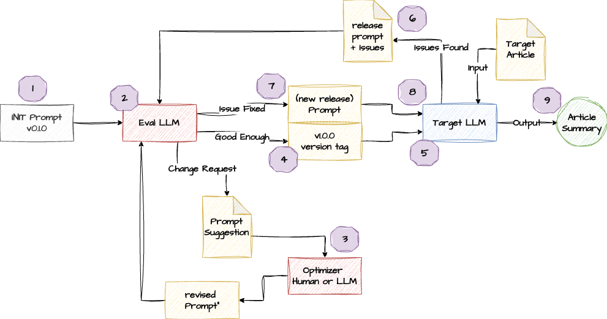

# Two Tips for LLM Prompt Engineering

隨著大型語言模型（LLM）的普及，提示詞（Prompt）已成為我們與 AI 協作的基礎。許多人習慣於使用直覺式的「懶人提示詞（Lazy Prompt）」來完成日常任務，這種方法雖然快速，但在追求穩定、高品質輸出的企業級應用場景中，往往會遇到瓶頸。當模型的回應不如預期時，我們該如何系統性地優化提示詞，而不是陷入反覆試錯的窘境？

本項目分享兩個實用的提示詞工程技巧，幫助你從『提示詞使用者』進階為『提示詞工程師』。我們將借鏡軟體工程的『設計審查（Design Review）』與『根本原因分析（Root Cause Analysis）』概念，學習如何與 LLM 協作，打造出更精準、更穩健的提示詞，提升 AI 應用的可靠性與效果。

---

## Lazy Prompt - 文章閱讀 AI 小幫手

每當我遇到長影片轉錄稿的閱讀情境時，往往需要投入大量時間與精力。
這樣的場景就很適合導入一個 Agent 來協助提升自己閱讀轉錄稿的效率。

而這個 Agent 的設計其實很單純，只需要協助我整理文章作者的核心觀點摘要，讓我能快速進行兩個判斷：
* 這篇文章是否與我的工作任務有關?
* 這篇文章是否與我的領域能力有關？

當文章屬於以上兩種「**與我有關**」的範疇，才需要我安排時間做進一步的研讀；反之，則只需將其歸類到我的「資源筆記」中儲存，暫時不做深入閱讀。

我把這個 Agent 命名為「**文章閱讀 AI 小幫手**」，它的設計目標就是幫助我快速過濾出與我有關的文章，並且提供核心觀點的摘要。

先分享一個我用 [**Andrew Ng - Lazy Prompt**](https://www.deeplearning.ai/the-batch/issue-295/) 概念設計的提示詞（[*init-prompt*](./init-prompts.md)），作為本次文章分享的範例。

```plaintext
你是一個大模型領域的專家，擅長用易於理解的文字讓工程師理解相關的技術知識，依據附加轉錄稿檔案內容，依據 markdown 格式中 #(h1) 和 ##（h2）主題範圍做區域拆分，一次一個主題範圍做理解，先依據主題標題與紀錄文稿內容為依據，總結出講者的核心理念與原理，然後總結出可以對研發團隊成員分享的精煉內容，每次輸出一個主題內容之後跟我確認，我回答OK之後，再繼續下一個主題範圍，直到完成所有檔案內容為止。
```

**Lazy Prompt 策略的侷限：品質未達企業服務使用標準**

**Lazy Prompt** 讓大模型來幫忙優化自己的初版提示詞，其設計直接而高效。
以我的使用經驗來看，這種方式雖然能夠**快速**產出有效的提示詞，但其品質水準仍僅適合用於個人日常與大模型的對話場景。

在長文本處理場景中，當需要與 LLM 進行多輪對話時，後期常會出現模型**一開始表現認真，之後卻逐漸偏離預期，甚至產生幻覺式輸出的情況**。

我推測這可能與各家模型在**強化學習訓練**上的設計取捨有關，例如為了節省 Token 與算力成本，使得模型在長對話場景中更容易出現不穩定行為。

**提示詞工程 Prompt Engineering 的 "登山杖"**

若你跟我一樣，希望進一步提升自己在提示詞設計上的**系統能力**，
Anthropic 影片 ***AI Prompt Engineering - A Deep Dive*** 所討論的主題：**Prompt Engineering** ，會是一個好的開始。

這裏整理出幾個觀點作為同仁理解 **Prompt Engineering** 的 **"登山杖"**：

* 模型不會像人類一樣主動提出關於你提示詞的澄清問題，因此、**提示詞工程師必須 “預先” 替模型把可能的疑問想清楚並補齊**。  

* 一種有效做法，是要求模型先「不要執行任務」，而是幫忙協助執行 「**Prompt Review**」，讓模型協助指出 **“提示中不清楚、有歧義或無法理解的地方”**。  

* 當模型執行結果不如預期的時，一個快速排查的方法，就是 **“直接詢問模型「為什麼會錯、指示哪裡導致誤解」”**，有時這樣的做法能有效找出提示中的缺陷。  

* 即使模型無法每次都準確診斷錯誤，這種互動仍能 **“讓人更理解模型實際是如何解讀指示的”**。

有了以上基礎認知的鋪墊，我們就可以開始這次分享的主題 - **兩個提示詞設計的小技巧**。

## Tip-1: 不要急著讓模型執行，而是讓模型幫忙 Design Review

可能是**宜家效應**的心理影響。
當人們對某個成果親自付出勞力或心力之後，往往會高估它的價值，覺得它特別好、特別值得。

當提示詞設計到自己滿意的階段時，往往會急著讓模型直接執行。一旦結果不如預期，反而難以釐清問題來源，使**提示詞優化**落入 **Try-and-Error** 的反覆嘗試狀態，進而掉入**知識的詛咒**。

以目前的模型發展階段來看，多數 LLM 已具備足夠能力執行**Prompt Review**，並提出具有參考價值的修改建議。

此時若能引用**軟體工程**的**Design Review**策略，**不要急著讓模型執行，而是讓模型幫忙 Design Review**，不但能提升提示詞的品質，更能訓練自己提示詞設計能力。

**Tip-1 操作步驟：**

1. 導入軟體版本管理概念，先把自己手動設計的 **初版提示詞 (init prompt)** 設定為 **version v0.1.0** 納入**版本管理**。

2. 將 **init prompt** 提交給 **Eval LLM(ChatGPT)** 執行 **Prompt Review**，並取得 **Prompt Suggestions**。

3. 依據 **Eval LLM(ChatGPT)** 給的回覆建議，先自己手動修改成新的版本 (revise version+1) ，然後再次回到**步驟2**，執行 **Prompt Review**，直到 **Eval LLM(ChatGPT)** 審核通過為止。

4. 將審核通過的提示詞設定為 **v1.0.0 （release version）**。

5. 將 **current prompt** (v1.0.0) 加上 **測試文章(Article)** 提交給 **Target LLM(ChatGPT)** 取得模型 **輸出結果 (Article Summary)** 之後，檢查模型輸出結果是否如 v1.0.0 版提示詞設計的結果目標。

**第一階段目標：取得 Eval LLM 審核通過的提示詞版本 v1.0.0 release version**

提示詞工程的第一階段，就是與 Eval LLM 合作共同開發出能夠通過 **Prompt Review** 的 **v1.0.0** 提示詞。

> Tip-1 的關鍵技能：訓練自己學會設計"**品質合格**"的提示詞

**ChatGPT 針對 "閱讀小幫手" v0.1.0 的審核回饋部分內容**

```markdown
**第一層關鍵問題：目標其實「混合了兩種輸出型態」**

目前這個 init-prompt 裡，隱含了兩個不同的「完成定義（Done Definition）」：
* A 類輸出：
  「總結出講者的核心理念與原理」
* B 類輸出：
  「總結出可以對研發團隊成員分享的精煉內容」

從 Prompt Engineering 的角度，這兩件事**不是同一層抽象**：

* 「核心理念與原理」＝**理解層（理解作者在說什麼、為何這樣說）**
* 「可對研發團隊分享的精煉內容」＝**轉譯層（站在你的位置，對團隊說什麼）**

現在的問題不是「寫得不好」，而是：

**模型會在每一輪輸出時，自行決定「我現在是在當讀書筆記，還是當內訓講師」**

這會導致幾個工程風險：

* 不同主題輸出風格不一致
* 有時偏忠於原講者，有時偏你自己的觀點
* 後續如果你要把輸出存進 repo，很難定義 review 標準

...(略)
```
**ChatGPT 點出 v0.1.0 文本意圖的一個混合目標的衝突：**

* 「總結出講者的核心理念與原理」→ 要求模型目標是「理解作者在說什麼、為何這樣說」

* 「可對研發團隊分享的精煉內容」→ 要求模型目標是「站在你的位置，對團隊說什麼」

這種混合目標的設計，容易導致模型輸出不一致，並不適合企業場景中對穩定輸出結果的需求。

> 這也是為什麼 Anthropic 的 AI Agent 專家不斷地強調，設計 Agent 需要先學會拆解流程；像我在 init-prompt 想要大模型同時扮演 **解讀專家** 與 **內訓講師** 兩個角色的設計，這樣的設計會迫使大模型自行決定當下要扮演的角色，進而提高輸出結果不穩定的風險。

經過了與 Eval LLM 三輪的提示詞迭代之後，終於通過了 **Prompt Review**，並設定為 **v1.0.0** 進行版本管理。

**AI 閱讀小幫手 v1.0.0 提示詞：**

```plaintext
請用大語言模型領域專家的標準，將附加的轉錄稿內容，依據 markdown 格式中 #(h1) 和 ##（h2） 主題範圍做區域拆分，一次一個主題範圍做理解，根據講者討論的主題標題與紀錄文稿內容為依據忠實理解，針對講者在該主題下反復強調、用來支撐主要結論的關鍵主張，不需要逐字轉錄例子與插曲，允許重組句子與段落順序，但不得引入原文未出現的新觀點或評價，重述講者的核心觀點，用 markdown 格式 code block 輸出，保留原本  markdown h1 and h2 title，code block 內請以條列或短段落呈現，避免長篇文章式改寫。每次輸出一個主題內容之後跟我確認，我回答OK之後，再繼續下一個主題範圍，直到完成所有檔案內容為止。
```

## Tip-2: 直接詢問模型：為什麼會錯？指出哪裡導致誤解？

我的「閱讀小幫手-v1.0.0」提示詞在 ChatGPT 模型執行時，能取得預期的輸出結果。

但是當我在 Gemini 模型執行上，卻發現模型輸出的結果，與我期望的結果有明顯的差異：
* Header-1 與 Header-2 被當成同一個文字區塊整理輸出
* 多個 Header-2 被當成同一個文字區塊整理輸出

```markdown
# AI 提示工程：深度解析 —— Anthropic
## Introduction

* **討論背景與目的**
    * 本場圓桌會議旨在探討提示工程（Prompt Engineering）的演進、實務技巧，以及隨著 AI 能力成長後的未來變化。
    * 參與者涵蓋研究端、消費端與企業端，旨在收集多樣化的觀點來定義何謂提示工程及其核心。

* **與會專家觀點分佈**
    * **Alex Albert (開發者關係)**：主持人，曾任提示工程師，連結技術與開發者社群。

(...)

## Defining prompt engineering

* **提示工程的本質**
    * **核心定義**：提示工程是與模型合作的過程，旨在將模型能力最大化，使其完成原本做不到的任務。本質上是與模型進行清晰的溝通。
    * **溝通對象**：與模型對話類似於與人對話，但需要深入理解模型的「心理」運作方式。

* **為何被稱為「工程 (Engineering)」？**
    * **迭代與實驗 (Iterative Process)**：工程性質來自於「反覆試驗」。使用者可以隨時按下重置鍵，從乾淨的狀態重新開始，獨立測試不同的做法而不受干擾。

(...)
```

如果你也和我一樣，對於 Gemini 在 **instruction-following （指令遵循）** 表現不如預期的原因感到困惑，可以嘗試使用 **Tip-2** 這個方法來處理：

**Tip-2 操作步驟：**

6. 若是發現模型輸出結果不如當初設計預期，則是將現有版本**current prompt** (v1.0.0)與實際執行結果的**問題描述**，再次提交給 **Eval LLM(ChatGPT)** 做分析，取得**修改建議**。

7. 依據**步驟 6**所取得的建議進行提示詞修改，將迭代後的版本設定為 **v1.1.x (release tag)** 並納入**版本管理**，接著重複**步驟 2**的迭代流程，直到通過 **Eval LLM(ChatGPT)** 的審核為止。

8. 將新版提示詞部署到產品環境中進行執行驗證。

9. 將符合預期輸出的提示詞設定為正式 release 版本，納入**版本管理**，並部署到產品環境中。

> Tip-2 的關鍵技能：訓練自己**分析提示詞問題原因**的能力。

**ChatGPT 針對 v1.0.0 的問題原因分析回饋**

```markdown
(...)

**一、先給結論（重點先說）**

這不是模型「不聽話」，而是 **v1.0.0 的提示詞在「主題邊界定義」與「輸出停止條件」上，存在可被模型合理誤解的空間**。

換句話說：
**模型並沒有違反你寫的規則，而是照它理解到的規則在執行。**

**二、問題一：`一次一個主題範圍` 在語義上不夠「可執行」**

你現在的關鍵約束是：

* 「一次一個主題範圍做理解」

但在模型眼中，這句話有**至少三種合理解讀**：

* 解讀 A：一個 h1 是一個主題範圍（h1 之下的所有 h2 都算同一範圍）
* 解讀 B：一組「h1 + 其下所有 h2」是一個主題範圍
* 解讀 C：一個 h2 也是一個主題範圍，但若 h2 很短，可以一起處理

也就是說，你**心裡的「主題範圍 = 單一 h1 或單一 h2」**，但 prompt 裡**從未明確定義這個等式**。

因此，模型一次輸出多個 h2，從它的角度看是合理的行為。

...(略)
```
> **感想**：真是驚訝現代大模型的語文理解能力 >_<

## **AI文章閱讀小幫手 - v1.1.3**

經過幾輪迭代之後，完成了最終的提示詞，可以同時用於 ChatGPT 和 Gemini。

```plaintext
請用大語言模型領域專家的標準，將附加的轉錄稿內容，依據 markdown 格式中相鄰的 `# H1 和 ## H2` 之間，或是兩個相鄰`# H1 和 # H1`之間，或是兩個相鄰 `## H2` 之間，當作一個文本範圍，一次一個文本範圍做理解，根據文稿講者紀錄文稿內容為依據忠實理解，針對講者在該文本範圍內反復強調、用來支撐主要結論的關鍵主張，不需要逐字轉錄例子與插曲，允許重組句子與段落順序，但不得引入原文未出現的新觀點或評價，重述講者的核心觀點，用 markdown 格式 code block 輸出，保留本次文本範圍起始的 title，code block 內請以條列或短段落呈現，避免長篇文章式改寫。每次輸出一個文本範圍的核心觀點，然後跟我確認，等我回答OK之後，再繼續下一個文本範圍，直到完成所有檔案內容為止。
```

## **總結**

在這篇文章中所分享的兩個技巧，對應著兩個提示詞工程的兩個核心技能：

* **Prompt Review**：訓練自己學會如何設計品質合格的提示詞

* **Prompt Optimize**：訓練自己學會如何分析提示詞問題原因

兩個 Tip 的步驟整合成一個簡易的 Engineering Flow Chart：



藉由這兩個技巧的分享，希望能夠協助同好進入 **提示詞工程 Prompt Engineering** 的世界，不斷訓練自己 **Enterprise Prompt** 設計的 **系統能力**。

---
本項目的靈感來源：[AI Prompt Engineering - A Deep Dive - Anthropic](https://www.youtube.com/watch?v=T9aRN5JkmL8)
